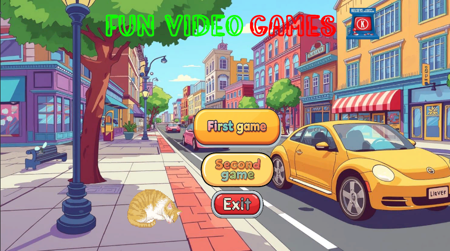
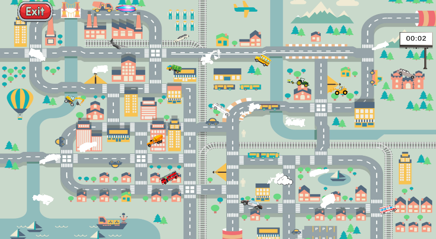
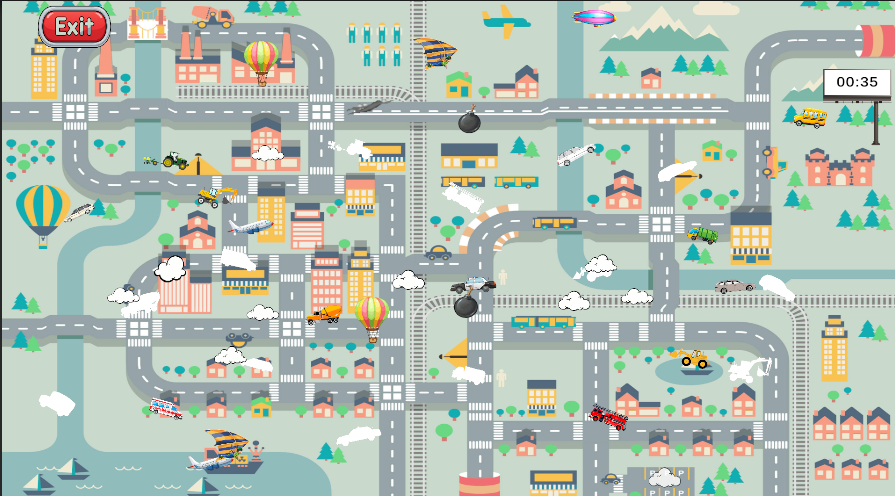

# DragAndDropGames
Unity 2D Drag And Drop games for children 6+

**To Do list:
- [x] Create the necessary folders
- [x] Add necessary assets
- [x] Add cars on the map
- [x] Create C# script for drag and drop
- [x] Create C# script for transformation
- [x] Create C# script fpr object fixation
- [x] Add necessary sounds and audio sources
- [x] Create winning logic
- [x] Create camera script zoom in and out
- [x] Create animated main menu with 3 buttons, sounds, animated objects
- [x] Create flying objects
- [x] Add random car spawner

# Unity 2D Drag And Drop Games
2D unity spēle, kas domāta bērniem ar drag&drop mašīnas spēli un jautra atmosfrēra

## Sākumlapa

Kā redzams mums šeit ir sākumalapa, kur lietotājs var izvēlēties pirmo vai otro spēli, kā arī iziet no spēles. Šī sākumlapa ir ļoti piemērota bērniem un rada ļoti draudzīgu atmosfēru.
## Pirmā spēle

Kā ir redzams šeit tiek ģenerētas 12 mašīnas nejaušās vietās un nolietoājs var uzklikšķināt uz tām un vilkt tās pa ekrānu. Spēlētaju mērķis ir ielikt mašīnu pareizā vietā, jeb pareizajā baltajā lauciņā, kurš ir vienādā izmērā ar mašīnu, bet ir pagriezsts savādākā virzienā un lietotājam ir jāizmanto Z un X taustiņus, lai pagrieztu mašīnas virzienu. Spēlētāja mērķis ir salikt visas 12 mašīnas pareizajās vietās, bet spēle nav tik viegla, kamēr lietotājs spēlēs šo spēli, apkārt pa karti lidos mākoņi un lidmašīnas no kuriem ir jāuzmanas, jo tie var iznīcināt mašīnu, bet tos var iznīcināt ar bumbām, bet no bumbām ir arī jāuzmanas, jo tās var arī iznīcināt mašīnu
### Pirmās spēles piemērs ar mākoņiem, lidmašīnām un bumbām

